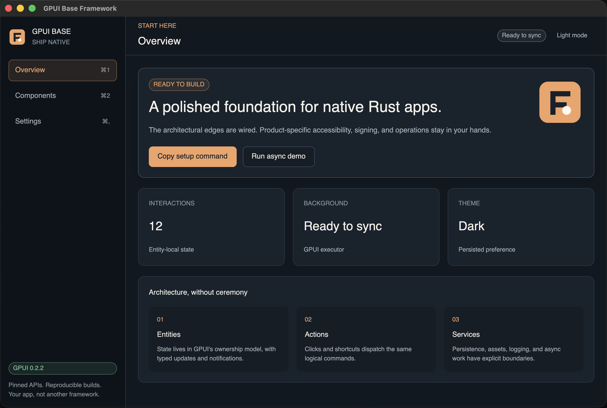

# GPUI Base Framework

A polished, production-minded template for native Rust applications built with
[GPUI](https://crates.io/crates/gpui).

This repository is meant to be copied, renamed, and shaped into a real product.
It gives new projects an application shell, a small semantic design system,
native actions and shortcuts, persistent settings, embedded assets, structured
logs, async work, tests, CI, packaging, and source-backed GPUI guidance — without
hiding GPUI behind another framework.



> **Version note:** this project pins the immutable crates.io release
> `gpui = "=0.2.2"`. Zed `main` now uses newer, unreleased APIs such as
> `gpui_platform::application()` and is not source-compatible. See
> [GPUI versioning](docs/GPUI_VERSIONING.md).

> **Accessibility boundary:** GPUI 0.2.2 does not expose public accessibility
> role/state APIs for custom controls. This showcase provides keyboard operation,
> visible focus, high-contrast tokens, and a responsive narrow layout, but its
> custom `div` controls cannot announce button/switch/selected/status semantics to
> assistive technology on this API line. Treat it as an architecture starter, not
> an accessibility certification. Read [the audit guide](docs/ACCESSIBILITY.md)
> before shipping and re-evaluate this boundary on every GPUI upgrade.

## Why this template?

GPUI is fast and expressive, but it is intentionally low-level and pre-1.0.
Most first apps need to solve the same non-demo work:

- establish a clean entity/view structure;
- turn pointer input and key bindings into the same typed actions;
- design focusable, reusable controls;
- decide which state is local, entity-owned, global, or durable;
- keep tasks and subscriptions alive for the correct lifetime;
- package assets without depending on the working directory;
- recover from corrupt settings without bricking startup;
- test logic and compile every native target;
- package an actual `.app`, Linux binary, or `.exe`.

This template makes those decisions visible and editable. It does **not** add a
generic `Component` trait, virtual DOM, or second state runtime. GPUI already has
`Render`, `RenderOnce`, `Entity`, actions, contexts, and elements.

## What ships

### Application foundation

- Responsive sidebar/content shell with Overview, Components, and Settings pages
- Semantic light/dark theme stored as a true GPUI global
- Typed actions shared by mouse controls and platform-aware key bindings
- Focusable, keyboard-activatable controls
- Entity-local state with explicit `cx.notify()` invalidation
- Typed `EventEmitter`/subscription flow with an intentionally retained
  `Subscription`
- Cancellable GPUI async task whose `Task` lifetime is owned by the view
- Clipboard integration and clean quit when the final window closes

### Reusable UI

The public `src/app/components/` module is the project’s owned UI kit. It contains
small GPUI-native `RenderOnce` primitives:

- buttons with primary, secondary, ghost, danger, size, disabled, hover, mouse,
  and keyboard states;
- semantic badges;
- composable cards;
- labeled toggles.

They are intentionally small enough to own and are exported through
`app::components` for reuse by pages or other crate targets. The colocated
[component guide](src/app/components/README.md) explains where new controls belong.
Stateful or IME-aware controls should be entities/custom elements, not stretched
into the same abstraction. GPUI core does not ship a production widget kit. These
controls deliberately demonstrate visible focus and unified pointer/keyboard
actions, but GPUI 0.2.2 cannot expose semantic accessibility roles; see
[the audit guide](docs/ACCESSIBILITY.md) and [Text input](#text-input) below.

### Production edges

- JSON settings in the OS-appropriate configuration directory
- `#[serde(default)]` forward-compatible preference loading
- corrupt-setting fallback with a visible in-app warning
- crash-resistant settings replacement with contextual errors and rollback on Windows
- `tracing` + `RUST_LOG` support
- compile-time embedded assets through `AssetSource` and `rust-embed`
- committed `Cargo.lock`, exact GPUI pin, Rust MSRV declaration
- thin LTO, one codegen unit, stripped release symbols
- unit tests for state, themes, and settings behavior
- cross-platform CI, MSRV verification, setup-script mutation tests
- tag-driven release workflow for Linux, macOS app bundles, and Windows
- weekly grouped Dependabot updates
- `AGENTS.md` and `CLAUDE.md` for AI coding tools

## Quick start

```bash
git clone https://github.com/binbandit/gpui-base-framework my-desktop-app
cd my-desktop-app
./setup.sh my-desktop-app --app-only
cargo run
```

The setup script renames the crate everywhere, safely escapes your Git author
identity, resets template metadata, replaces this template README with an
app-facing one, and validates the result. Mutations are transactional: any build
or fresh-history failure restores the original tree, and the script deletes
itself only after success.

Choose the shape that matches your project:

```bash
./setup.sh my-app                 # library + showcase + examples
./setup.sh my-app --app-only      # recommended product layout
./setup.sh my-app --minimal       # bare, one-file GPUI hello world
./setup.sh my-app --no-examples   # keep library, remove learning examples
```

Other options: `--fresh-git`, `--yes`, and `--help`.

## Run the examples

```bash
cargo run --example hello_world
cargo run --example counter
cargo run --example async_task
```

Every example is one self-contained source file. The progression teaches window
startup, actions/entity updates, then async task lifetimes. See
[examples/README.md](examples/README.md).

## Project structure

```text
gpui-base-framework/
├── src/
│   ├── app/                    # Self-contained starter application
│   │   ├── actions.rs          # Logical commands + default key map
│   │   ├── assets.rs           # Embedded AssetSource
│   │   ├── components/         # Public, reusable GPUI controls
│   │   ├── pages/              # One module per route-level screen
│   │   ├── services/           # Settings and future IO boundaries
│   │   ├── shell/              # Sidebar, header, global notices
│   │   ├── root.rs             # State, tasks, subscriptions, actions
│   │   ├── state.rs            # Pure domain state
│   │   ├── theme.rs            # Semantic palettes + Theme global
│   │   └── mod.rs              # Bootstrap and public app surface
│   ├── lib.rs                  # Thin app re-export
│   └── main.rs                 # Tiny launcher
├── examples/                   # Self-contained learning programs
├── assets/                     # Embedded application assets
├── docs/
│   ├── ACCESSIBILITY.md
│   ├── ARCHITECTURE.md
│   └── GPUI_VERSIONING.md
├── .github/workflows/          # CI + native release packaging
├── setup.sh                    # One-command project ownership
├── QUICKSTART.md
├── CHEATSHEET.md
└── AGENTS.md
```

`src/app/` imports siblings through `crate::app`, never through the package name.
That load-bearing boundary lets `setup.sh --app-only` remove `src/lib.rs`, declare
`mod app`, and keep the implementation unchanged. `RootView` coordinates state;
`pages/` renders route content; `shell/` renders stable window chrome;
`components/` owns reusable controls; and `services/` isolates external IO.

## Core GPUI patterns

### Entities and rendering

A root window owns an `Entity<RootView>`. GPUI calls `Render::render`, and the view
builds an element tree:

```rust
impl Render for RootView {
    fn render(&mut self, window: &mut Window, cx: &mut Context<Self>) -> impl IntoElement {
        div()
            .size_full()
            .child(format!("{} px wide", window.viewport_size().width))
    }
}
```

Call `cx.notify()` after a state change that should redraw or notify observers.
Keep pure product transitions in plain Rust types when they do not need GPUI.

### Actions

Actions are logical operations, not keystrokes. Bind keys once and dispatch the
same action from pointer controls:

```rust
actions!(my_app, [Save]);
cx.bind_keys([KeyBinding::new("cmd-s", Save, Some("MyApp"))]);
```

`cmd` maps to the platform command modifier. Scope handlers with
`.key_context("MyApp")` and `.on_action(cx.listener(Self::save))`.

### Async work

GPUI cancels a `Task` when it is dropped. Store tasks that belong to a view:

```rust
let timer = cx.background_executor().timer(Duration::from_secs(1));
self.task = Some(cx.spawn(async move |view, cx| {
    timer.await;
    let _ = view.update(cx, |view, cx| {
        view.status = "Finished";
        view.task = None;
        cx.notify();
    });
}));
```

Detach only work that deliberately outlives the initiating entity and cannot
update released UI.

### Subscriptions

Dropping a `Subscription` unsubscribes. Store it on the owner or call `.detach()`
only for an application-lifetime observer. The showcase retains its typed sync
subscription as `_sync_subscription`.

## Text input

A correct desktop text editor must support UTF-8/UTF-16 range conversion, grapheme
boundaries, selection, marked text/IME composition, clipboard commands, focus,
mouse hit testing, shaped text, and platform input callbacks. A key-down handler
that appends `char`s is not a production text field.

GPUI 0.2.2 includes an authoritative low-level implementation in its immutable
[`examples/input.rs`](https://docs.rs/crate/gpui/0.2.2/source/examples/input.rs).
Adapt that implementation when you need a custom editor, or deliberately add a
component toolkit compatible with exactly GPUI 0.2.2. This template does not
silently ship a partial input that breaks international users.

## Settings and errors

`SettingsStore` returns defaults when no file exists. Malformed or unreadable
settings produce safe defaults plus an in-app warning. Save failures keep the
session change, emit a tracing warning, and inform the user.

Before shipping, change the `ProjectDirs` organization/application identity in
`src/app/services/settings.rs` with a migration plan. Renaming the folder after
users have settings creates a new path.

## Platform prerequisites

GPUI supports native macOS, Linux, and Windows. It is GPU accelerated and requires
native development libraries.

### macOS

Install Xcode and its command-line tools:

```bash
xcode-select --install
```

This template enables GPUI 0.2.2's `runtime_shaders`, so recent Xcode versions do
not require the optional Metal Toolchain for normal builds. See the versioning
guide before changing that feature.

### Linux (Debian/Ubuntu)

The exact package names vary by distribution. Typical development dependencies:

```bash
sudo apt-get install build-essential clang libfontconfig-dev libwayland-dev \
  libxkbcommon-dev libxkbcommon-x11-dev libxcb1-dev libx11-xcb-dev \
  libxcb-render0-dev libxcb-shape0-dev libxcb-xfixes0-dev libvulkan-dev
```

The crate enables both Wayland and X11 by default. Trim features only after testing
the environments you intend to support.

### Windows

Install the Rust MSVC toolchain and Visual Studio Build Tools with Desktop
Development for C++ and a current Windows SDK.

## Quality checks

```bash
cargo fmt --all -- --check
cargo check --all-targets
cargo test --all-targets
cargo clippy --all-targets --all-features -- -D warnings
RUSTDOCFLAGS="-D warnings" cargo doc --no-deps
shellcheck setup.sh
```

CI also tests the declared MSRV, all three host platforms, and every setup mode on
GNU and BSD userlands. GPUI compilation is not a runtime test: exercise real
packaged windows on every platform before release.

## Releasing

Tag a version:

```bash
git tag v0.1.0
git push origin v0.1.0
```

The release workflow builds Linux x86_64/arm64 archives, macOS Apple Silicon/Intel
`.app` bundles, and a Windows zip, then uploads SHA-256 checksums with generated
release notes. Review bundle identifiers, signing, notarization, icons, and update
strategy before distributing outside development.

## Customizing and trimming

1. Run `setup.sh`; do not hand-rename first.
2. Replace `Route` and the modules under `src/app/pages/` with product concepts.
3. Rebrand semantic token values, not every view.
4. Add shared controls under `src/app/components/`; keep page-only helpers local
   until they have a second caller.
5. Change persistent identifiers before users create data.
6. Replace example sync work with a service/entity boundary.
7. Delete learning examples and template-only documentation when they stop helping.
8. Add signing, crash reporting, accessibility audits, and end-to-end smoke tests
   appropriate to your product.

## Documentation map

- [QUICKSTART.md](QUICKSTART.md) — first project changes
- [CHEATSHEET.md](CHEATSHEET.md) — copy-ready GPUI patterns
- [src/app/components/README.md](src/app/components/README.md) — reusable UI guide
- [docs/ARCHITECTURE.md](docs/ARCHITECTURE.md) — ownership and boundaries
- [docs/ACCESSIBILITY.md](docs/ACCESSIBILITY.md) — API limits and release audit
- [docs/GPUI_VERSIONING.md](docs/GPUI_VERSIONING.md) — avoiding stale API traps
- [AGENTS.md](AGENTS.md) — coding-agent and contributor invariants

## License

Licensed under either MIT or Apache-2.0, at your option.
